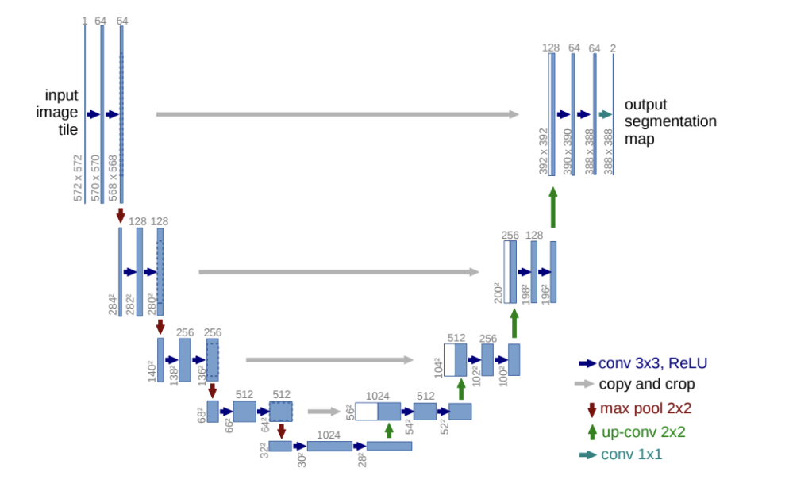
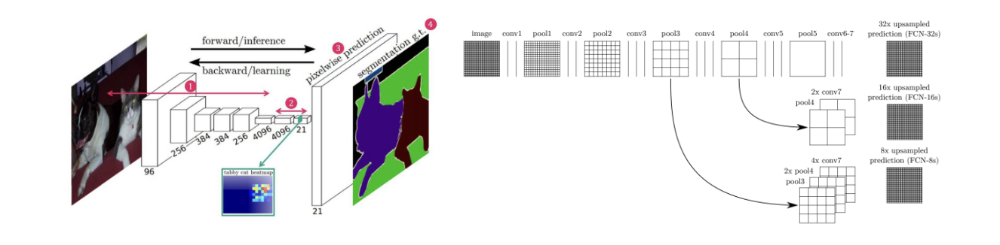
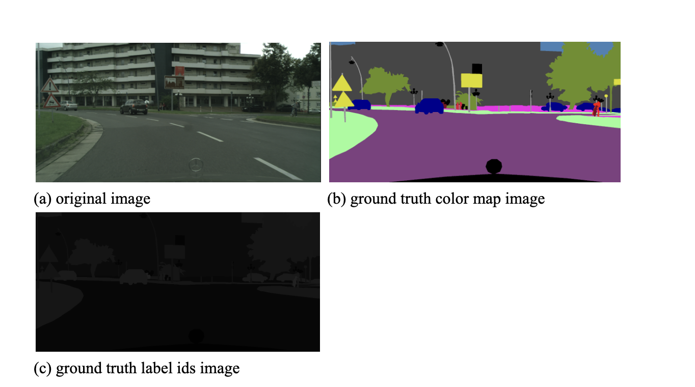
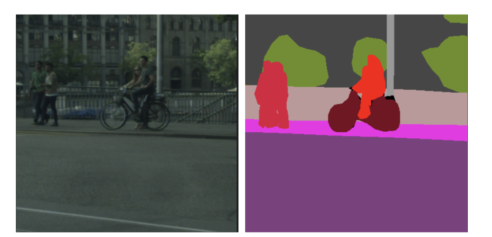
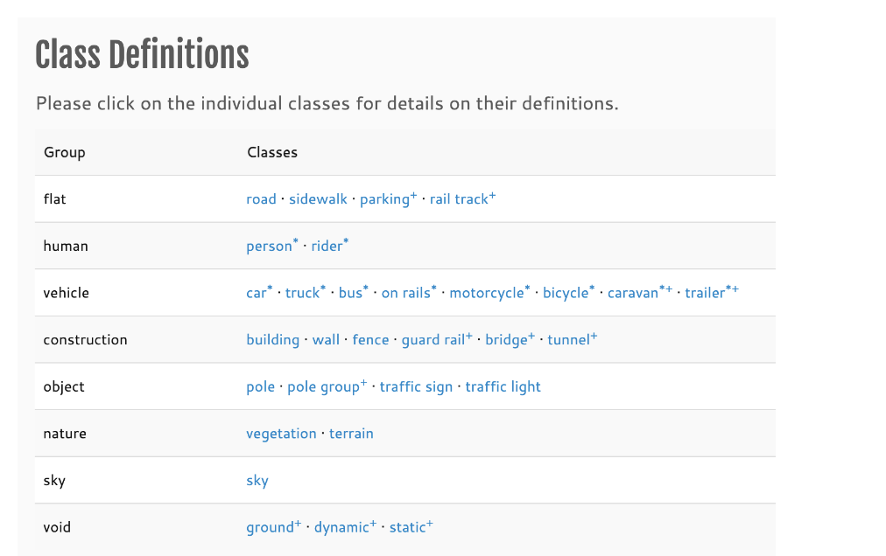
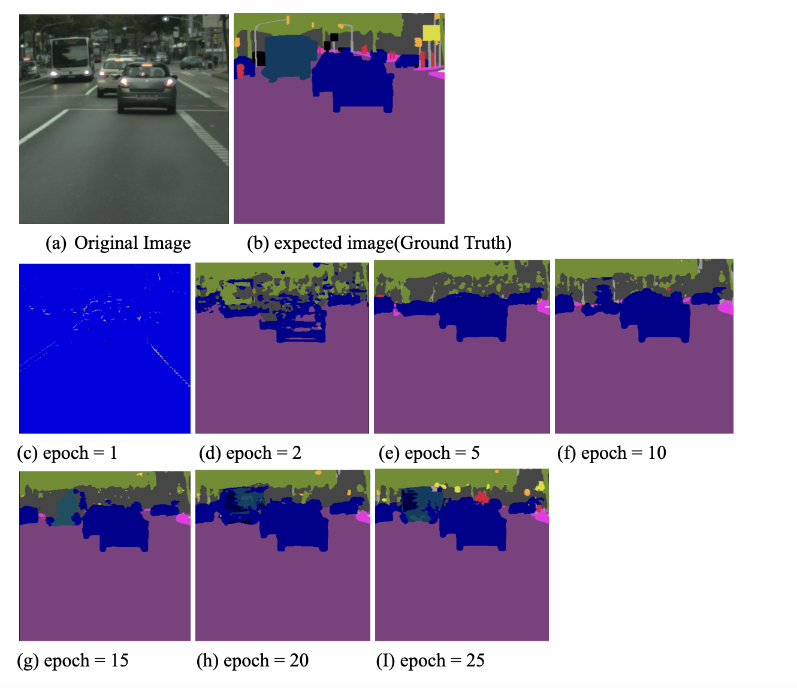
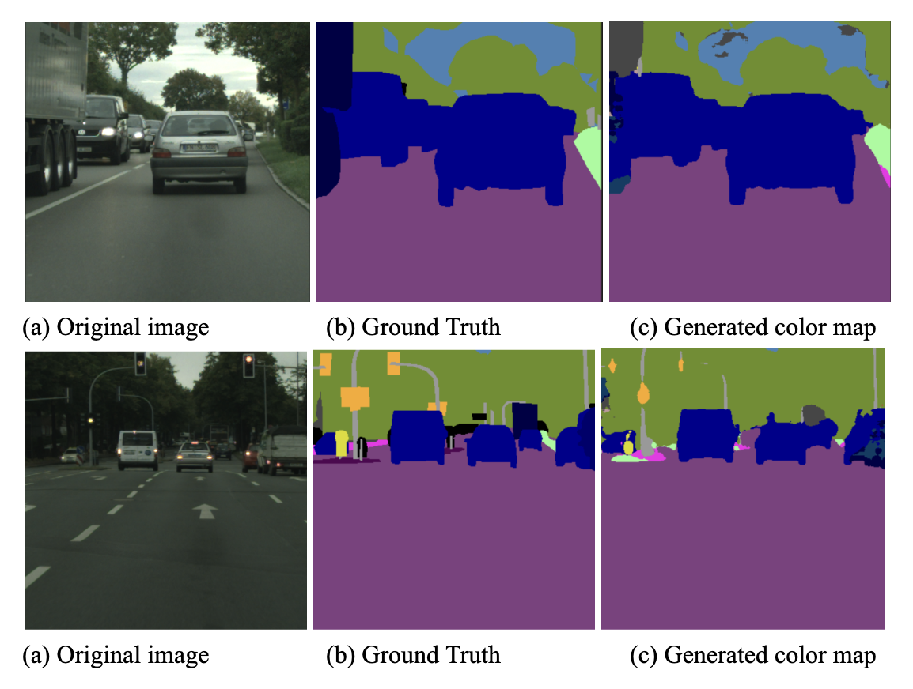

# UNet Scratch with CityScapes dataset
I implemented UNet with Cityscapes dataset.

### UNet

UNet is the one of the baseline segmentation models. It is created to segment biomedical images. Biomedical images are grayscale images, and they don’t have lots of datasets(Also, small size of images). So, the focus of the Unet is to segment well with less data. Also, the bio image has lots of pattern features, so its goal was the abstract features well. UNet consists of the convolutional neural networks(CNN). And it has a contracting path, expanding path and skip connection. 

This describes the U-Net architecture. In the contracting path, we abstract deeper features through downsampling. Initially, in each layer, we preserve the number of channels while reducing the image's size. As shown in the illustration, to achieve this, a CNN with a 3x3 kernel (filter), stride of 1, and the ReLU activation function is used twice. After that, max pooling with a 2x2 kernel size is applied to halve the image size. These steps are repeated throughout the contracting path. At the end of this path, dropout is applied as mentioned in the original paper.
In the expanding path, we will use a transpose convolutional neural network for upsampling. It increases the reduced image size. Even so, the size will still be reduced compared to the input image size. This is because U-Net maintains a symmetrical structure, meaning the number of contracting and expanding layers must match. According to the paper, no padding was used in the convolutional neural network. Therefore, some people choose to add padding. However, using padding can blur the features at the edges. I think that’s why they didn’t use padding in the Unet is originally designed for segmenting bio-images like cellular images, aiming to preserve edge features by not using padding. But I used the Cityscapes dataset, edge details and abstract features may not be as critical as in cellular images, I followed the paper's approach by not adding padding and cropping the ground truth label images to match the model's output size. Also, in the expanding path, the crucial element is the skip connection. As mentioned earlier, U-Net has a symmetrical structure. Thus, corresponding contracting and expanding layers are concatenated. This approach allows the model to maintain contextual and locational information about the lost features during expansion. Lastly, the final layer of U-Net is a 1x1 convolutional network. Setting the output channels to the number of classes allows us to know the logits for each class per pixel.

### Previous model(FCN)



FCN(Fully Convolutional Network) is also based on CNN. FCN utilizes pre-trained classification models like VGG by removing the fully connected layers. And they use 1 * 1 conv instead of a fully connected layer. This change is made because using fully connected layers would flatten the data, thereby losing spatial information. Therefore, FCN uses 1 * 1 convolutional layers to perform classification on each pixel and then upsample these classifications to the original image size. Additionally, by eliminating fully connected layers, FCN can handle images of arbitrary sizes. So, I think the two key features of FCN are the use of images of arbitrary size and the use of 1 * 1 convolutional layers. Like UNet, FCN combines information from both downsampling and upsampling processes. The FCN paper refers to this as the skip architecture, which is crucial because spatial information becomes diluted when using CNN. I think the primary difference between UNet and FCN is that UNet extracts features through downsampling and upsampling before performing pixel-wise classification, whereas FCN classifies each pixel after downsampling and then upsamples again.

### My Implementation

I used the cityscapes dataset. There are 2975 images for training and 500 images for validation and 1525 for testing images. I used 2975 training data and 500 validation data(for testing). In this data set, there are 30 classes, but I used only 19 classes. But we also can use all 30 classes by modifying the label ids. 



We can get these three types of images from the city scape dataset for semantic segmentation. When we input the original image, we can get the logit of classes in each pixel, then finally, we can get the color map by converting label ids to rgb color. 

Original Image has 3 channels because it is the color image, and its height is 1024, and its width is 2048. Color map and label ids image is also (1024, 2048). However, I center crop the original image into (572, 572), and crop the label ids image into (388, 388). Because as I mentioned above, the image size will be reduced during passing the Unet. 



This is the cropped image. So, I will input the left image and get the right image. 



These are classes of the cityscapes dataset.

```python
converted_label = {
       0:255,
       1:255,
       2:255,
       3:255,
       4:255,
       5:255,
       6:255,
       7:0,
       8:1,
       9:255,
       10:255,
       11:2,
       12:3,
       13:4,
       14:255,
       15:255,
       16:255,
       17:5,
       18:255,
       19:6,
       20:7,
       21:8,
       22:9,
       23:10,
       24:11,
       25:12,
       26:13,
       27:14,
       28:15,
       29:255,
       30:255,
       31:16,
       32:17,
       33:18
   }
```

And I will use only 19 classes. 
There are real ids in each class, and I coveted it into used class ids. I will ignore 255 when calculating cross entropy loss. 

My step to implement is like this:
1. Make CSV file
2. Make dataset for data loader
3. Implement the Unet model
4. Train and Test

### Dataset

- Source image transformation
  1. Make it to tensor and center crop to (572, 572)
   
      When I convert an image to tensor, the values adjust automatically between 0 to 1.

  2. Normalize source image.
   
      I used Z-score normalization. This equation is Z = (X - mean) / std. 
I calculated the mean and standard deviation. Mean: [0.28689554, 0.32513303, 0.28389177]. Std: [0.18696375, 0.19017339, 0.18720214]. 
By normalizing, we adjust the mean of the data to 0 and the standard deviation to 1, making the distribution of the data follow a normal distribution. This makes the data more robust to outlier data, improves the learning speed, and achieves numerical stability. Furthermore, it actually enhances the results of classification.

- Gt Image transformation
  1. I converted the real label into a used label here. The label IDs are represented as integers, but converting them directly into tensors would rescale the values from 0 to 1. Therefore, I converted them into tensors while preserving the integers.
  2. I center crop it into (388, 388).

 ### Train / Test

1. Set hyper params: epoch = 30, learning rate = 1e-4, criterion = cross entropy loss(ignore idx = 255), optimizer = Adam
2. Source image passes the Unet model.
3. We can get the logit of classes in each pixel. 
4. Calc loss with the model result and ground truth label ids. 
5. Back propagation
6. Save the image
7. When saving the image, I generated a color map (segmentation map) by converting ground truth ids into rgb color. I made a new zero array with (H, W, 3), and gave r, g, b values. 

```python
color_dict = {
       0: (128, 64, 128),
       1: (244, 35, 232),
       2: ( 70, 70, 70),
       3: (102, 102, 156),
       4: (190, 153, 153),
       5: (153, 153, 153),
       6: (250, 170, 30),
       7: (220, 220, 0),
       8: (107, 142, 35),
       9: (152, 251, 152),
       10: (70, 130, 180),
       11: (220, 20, 60),
       12: (255,  0,  0),
       13: (0, 0, 142),
       14: (0, 0, 70),
       15: (0, 60, 100),
       16: (0, 80, 100),
       17: (0, 0, 230),
       18: (119, 11, 32)
   }
```

### Train Result



### Test Result



### mIoU

I calculated average loss and mIoU, and it shows Avg Loss: 0.4051, Mean IoU: 0.6426.


